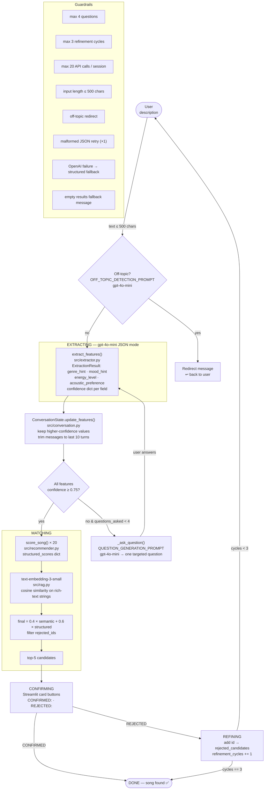

# 🎵 VibeFinder 2.0

**Base project:** VibeFinder 1.0 (Module 3 — Music Recommender Simulation)

VibeFinder 2.0 upgrades the original static scoring system into a conversational AI agent. The user describes a half-remembered song (or a mood they're in), the agent asks up to four clarifying questions, fuses structured scoring with semantic embeddings, and surfaces the best matches from a 20-song catalog with "This is it ✓ / Not quite ✗" confirmation buttons.

---

## Architecture



---

## Demo Walkthrough
[](https://www.loom.com/share/c264086326f9485dab2be4987039d890)

Video: https://www.loom.com/share/c264086326f9485dab2be4987039d890

## Setup

### Prerequisites

- Python 3.10+
- An OpenAI API key

### Installation

```bash
git clone <repo-url>
cd lost-song-recovery-ai

# Create and activate virtual environment (optional but recommended)
python -m venv .venv
source .venv/bin/activate      # Mac / Linux
.venv\Scripts\activate         # Windows

# Install dependencies
pip install -r requirements.txt
```

### Environment variables

Copy `.env.example` to `.env` and fill in your key:

```bash
cp .env.example .env
# Edit .env and set: OPENAI_API_KEY=sk-...
```

**Never commit `.env`.** It is listed in `.gitignore`.

### Run the Streamlit app

```bash
streamlit run src/app.py
```

### Run the original CLI recommender (VibeFinder 1.0)

```bash
python -m src.main
```

### Run all tests

```bash
pytest
```

---

## Sample Interactions

### 1 — Lofi study session found on first match

```
User:  "Something chill and acoustic to study to, lots of rain sounds vibe"

Agent: [extracts: genre=lofi, mood=chill, energy=0.35, acoustic=True, all confidence ≥ 0.85]
       [matches — no questions asked]

Candidates:
  #1  Library Rain — Paper Lanterns     match 94.1%
  #2  Midnight Coding — LoRoom          match 91.3%
  #3  Focus Flow — LoRoom               match 82.0%

User clicks: ✓ This is it  →  "Library Rain"

Agent: "Found it! Library Rain by Paper Lanterns. Enjoy! 🎵"
```

### 2 — Late-night driver recovered after one clarifying question

```
User:  "I remember a track from a night drive, kind of dark and electronic"

Agent: [extracts: genre=synthwave confidence 0.72, mood=moody confidence 0.65 — below threshold]

Agent: "Was it purely electronic/synth, or did it have live guitar or drums in it?"

User:  "Fully electronic, no live instruments at all"

Agent: [re-extracts: acoustic_preference=False confidence 0.92 — now all features confident]
       [matches]

Candidates:
  #1  Night Drive Loop — Neon Echo     match 97.6%
  #2  Overdrive Protocol — Flux State  match 56.2%

User clicks: ✓ This is it  →  "Night Drive Loop"
```

### 3 — Refinement cycle after rejection

```
User:  "Angry metal workout track"

Agent: [extracts: genre=metal, mood=angry, energy=0.95, acoustic=False — all confident]

Candidates:
  #1  Iron Curtain — Razorback    match 96.2%
  #2  Storm Runner — Voltline     match 73.4%

User clicks: ✗ Not quite  →  "Iron Curtain"

Agent: "Got it — let me refine. What else can you tell me about the song?"

User:  "It had more of a rock feel, less pure metal"

Agent: [re-extracts: genre=rock — updated]
       [Iron Curtain rejected, re-matches]

Candidates:
  #1  Storm Runner — Voltline     match 80.1%
  #2  Iron Curtain excluded (rejected)

User clicks: ✓ This is it  →  "Storm Runner"
```

---

## Design Decisions

**Why a generator-based agent loop?**
The `run_session()` function is a Python generator that yields event dicts and receives user input via `.send()`. This keeps the entire state machine in one place (no callbacks, no async), makes it trivially testable with mocked clients, and lets Streamlit stream events to the UI without threading.

**Why fuse structured scores with semantic embeddings?**
Structured scoring (VibeFinder 1.0) is precise but brittle — "heavy fast music" doesn't map cleanly to `genre=metal`. Semantic embeddings catch natural-language descriptions that the keyword matcher misses. Weighting 60% structured / 40% semantic preserves the explainability of the original system while broadening its surface area.

**Why gpt-4o-mini for extraction and questions?**
gpt-4o-mini is fast and cheap enough to call multiple times per conversation without noticeable latency. The structured outputs (JSON mode + Pydantic) mean the model's free-text generation is constrained to a schema, eliminating most hallucination risk for the feature fields.

**Why Pydantic for ExtractionResult?**
Pydantic validates field types and ranges (e.g. `0.0 ≤ energy_level ≤ 1.0`) at parse time. A malformed LLM response fails fast and cleanly — the retry-then-fallback path kicks in instead of passing bad data downstream.

---

## Testing Summary

| File | Tests | What's covered |
|---|---|---|
| `tests/test_recommender.py` | 7 | Scoring algorithm, genre tiers, diversity, CSV loading |
| `tests/test_extractor.py` | 6 | Acoustic detection, energy from adjectives, genre from instruments, off-topic, bad JSON fallback, confidence accumulation |
| `tests/test_rag.py` | 5 | Lofi retrieval, folk retrieval, OpenAI fallback, fusion formula, rejected-ID exclusion |
| `tests/test_agent.py` | 7 | Question cap, early termination, off-topic redirect, rejection tracking, refinement trigger, feature accumulation, full API failure |
| **Total** | **25** | All mocked — no live API calls required |
